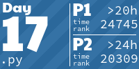

<!-- AOC TILES BEGIN -->
<h1 align="center">
  2024 - 50 ⭐ - Python
</h1>

<!-- AOC TILES END -->
<h1 align="center">
  Takeaways
</h1>
<ul>
<li>Needed my first hint on Day 6 Part 2</li>
<li>Consistently needed hints from Day 11 onwards</li>
<li>Could not solve Day 17 Part 2 and Day 24 Part 2 on my own and ended up looking at others' solutions</li>
<li>Wish I took a stab at using regex for Day 3</li>
<li>Became more confident implementing BFS, DFS, Dijkstra's to solve search problems</li>
<li>Learned about the Bron-Kerbosch algorithm to solve the maximal clique problem on Day 23 Part 2</li>
<li>Re-learned dynamic programming and memoization to solve several problems (tbt to CPSC 320)</li>
<li>Familiarized myself with Python's standard library and other Pythonics (s/o to list comprehension and lambda functions)
<li>Proud that I was consistent with solving AoC daily and that I was able to complete all 25 problems before the new year</li>
<li>Will attempt to solve AoC again next year either with a new language or a language I use at my job</li>
</ul>
